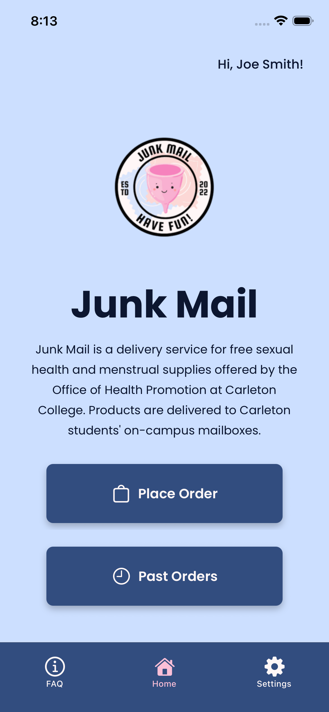
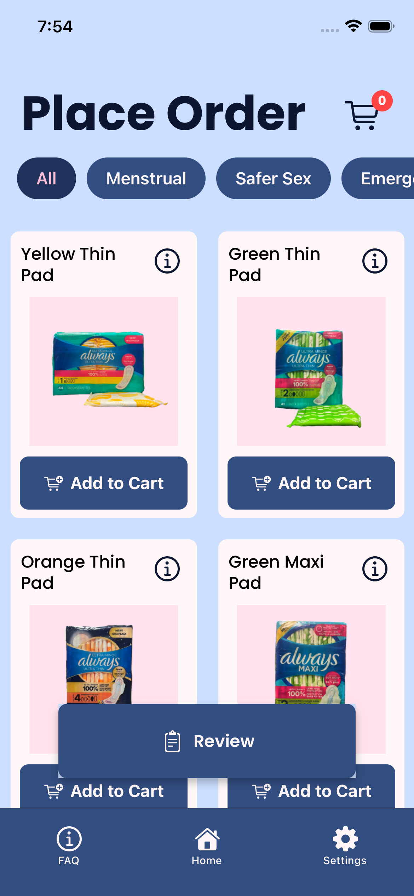
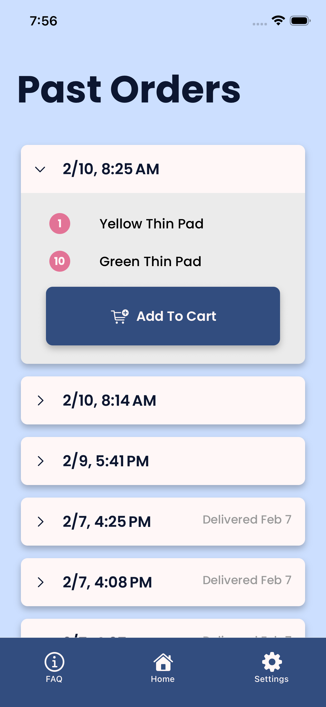
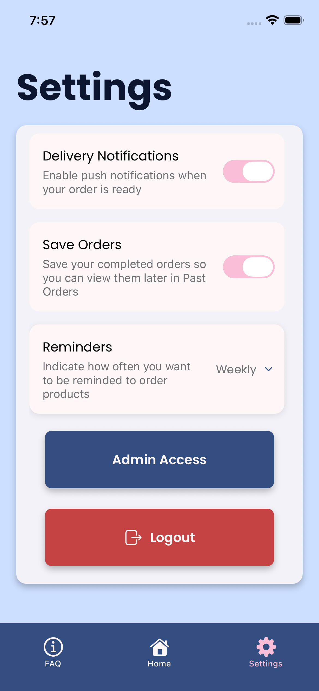
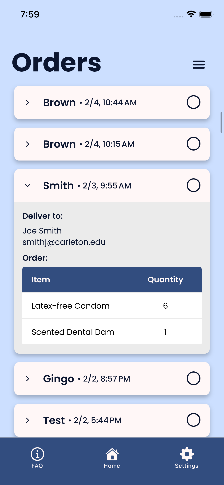
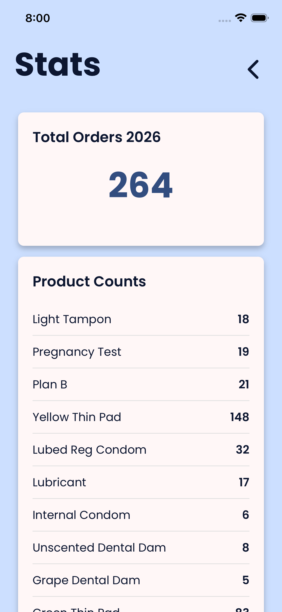

# Overview

This app was developed for the Office of Health Promotion Junk Mail program at Carleton College. This app is designed specifically for Carleton college students and the Student Wellness Advocates who run the program and fill orders. It was developed to replace the current Google Form ordering system for menstrual/safe-sex supplies. The app allows all Carleton students to create an account with their school email and then log in to order these supplies.

### Tech Stack

Our app is written in React Native to allow users to access on both iOS/Android without having to write separate codebases. Firebase Authentication was used to create and store user accounts and Firestore database stores and tracks all orders.

### Features

* Shopping page for all products with images and product info
* Reminder and order notifications
* Past order page
* FAQ page for program and other health-related resources on campus
* Admin/order fulfillment side

### Development Team

* [Maddy Brown](https://github.com/maddyBrown19)
* [Daniel Estrada](https://github.com/DanielEstradaE)
* [Cameron Richardson](https://github.com/camsr003)
* [Stella Thompson](https://github.com/stellathompson)
* [Ella Visconti](https://github.com/viscontie)
* [Alex Wcislo](https://github.com/Alexwcislo)

## Installation

Clone this repository. Follow the steps listed in [this article](https://docs.expo.dev/get-started/set-up-your-environment/) to set up an Expo Go environment on your computer. Expo Go will run a device simulator that allows you to develop the app live. Execute the command `npx expo go` via the terminal to open the simulator and interact with the app.

## Usage

The primary audience for this app is Carleton students looking for free, discreet access to sexual health supplies on campus. Students can use our app to place orders for sexual health supplies, view their past orders, and opt into delivery or order reminder notifications. On the admin side, Student Wellness Advocates that work at the Office of Health Promotion and fill Junk Mail orders can use the app to track incoming orders, mark orders as completed, send delivery reminders, and view stats on product popularity.

## Future steps

In accordance with Carleton College security standards, the app is currently only available for download via sideload. This is because the app is not yet integrated with our campus Single Sign On. Future scope for this project involves integrating with Single Sign On so the app is secure enough to deploy to the Apple App Store and the Google Play Store.